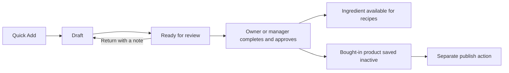

# Quick Add — first-version design and repository review

Reviewed 9 October 2026. Scope: Session 1 of [the working checklist](QUICK_ADD_TODO.md).
The review below records the Session 1 design. Session 2 has since been implemented
locally; see the implementation notes at the end. The user applied the Session 2
migration in Supabase; its table and access controls were verified read-only on
9 October 2026. Deployment and physical-phone testing remain pending.

## Scope and decisions

Build one responsive admin workflow for computers, tablets and phones. Start with
ingredients and bought-in products; prepared recipes remain in the full editor.

**Confirmed by the owner:** staff capture and submit drafts; owners and managers
approve, including their own entries, with approval recorded.

**Recommended implementation:** keep delivery captures in a separate draft area.
Do not insert an ingredient or menu item until approval. Ingredients become usable
recipe inputs after approval. Bought-in products become inactive menu records;
publication remains a separate action. The remaining UX defaults below are
proposals, not decisions already confirmed by the owner.

## What exists and what it means for Quick Add

| Area | Repository evidence | Design implication |
|---|---|---|
| Ingredient creation | [New ingredient form](app/admin/ingredients/new/page.tsx) checks the name and initialises allergen values to `none`. [POST endpoint](app/api/ingredients/route.ts) immediately inserts `status: active` and `compliance: compliant`. | Do not route partial captures through this endpoint or copy its allergen defaults. An unassessed draft must say Unknown / not reviewed. |
| Ingredient availability | Ingredient GET lists all business ingredients. [Menu safety calculation](lib/server/menu-item-safety.ts) checks business ownership but does not filter by ingredient status. | Merely adding a draft status to existing ingredients would not isolate them from recipe selection/calculation. |
| Public kiosk | [Kiosk data](app/api/kiosk/data/route.ts) includes active menu items and a separate ingredient list excluding only archived ingredients. | An ingredient draft in the existing table could reach the public data response even without a recipe link. Separate captures avoid this path. |
| Bought-in products | [New menu form](app/admin/menu-builder/new/page.tsx) supports packaged products, requires name and description in the UI, and saves active. [Product validation](lib/server/menu-item-product.ts) checks supplier ownership and verification-date format but does not require completed label review. | Existing packaged-product fields can be reused at approval, but normal creation is not a review gate. |
| Supplier-specific information | [Supplier profiles](lib/ingredient-supplier-profiles.ts) have `needs_review` / `assessed` states. [Variant helpers](lib/server/ingredient-supplier-variants.ts) create suppliers and synchronise variants. | Preserve the exact supplier/product assessment when promoting a capture. Do not accidentally change an existing ingredient with a similar name. |
| Documents | The current forms create the record first, then call [datasheet upload](app/api/upload/datasheet/route.ts). That route requires an existing ingredient/menu item and returns a public URL. | Draft photo uploads need their own attachment association and private access. Failed uploads must leave a resumable draft, not trigger duplicate record creation. |
| Mobile file picker | [DatasheetUploader](components/admin/DatasheetUploader.tsx) supports multiple files, including JPG/PNG, alongside documents. It has no dedicated camera capture control; accepted types omit HEIC. | Reuse presentation where helpful, but add a deliberate photo flow, previews and tested format/size handling. Real camera behaviour still needs device testing. |
| Roles | [Session endpoint](app/api/auth/session/route.ts) resolves current business membership. [Content permissions](lib/hooks/useContentPermissions.ts) restrict deletion, not creation or approval. | Add server-side Quick Add permissions using live membership on every operation. Hiding buttons is insufficient. |
| Locations | [Sites endpoint](app/api/sites/route.ts) lists sites by business. [Team management](lib/team-management.ts) assigns business roles; no per-staff site restriction was found in these paths. Ingredients are business-wide. | A capture location is initially delivery context, not a new access boundary. Validate business ownership of the selected site. Staff-to-site restrictions would be additional scope. |
| Existing review | [Mark reviewed](app/api/compliance/mark-reviewed/route.ts) renews a date and logs it; it does not validate all completion requirements or restrict review to managers/owners. | Do not treat this action as Quick Add approval. Keep a dedicated approval gate. |
| Reports and exports | [Business data](app/api/business/data/route.ts), used by [Downloads](app/admin/downloads/page.tsx), fetches active menu items and all business ingredients. [Analytics](app/api/analytics/route.ts) has its own active counts. | Separate captures stay out of normal inventory/export totals. Show their count explicitly as Items needing review. |

These are findings in the reviewed code, not a comprehensive security audit or a
verification of every live database policy. Existing workflows are not being
silently changed as part of this planning step.

## Proposed screens

Entry points: dashboard, Ingredients and Menu Builder. On phones use a full-height
panel with a visible Save draft action; on desktop use a compact dialog or panel.
Both use the same fields and saved records.

```text
Quick Add
  What arrived?  [Ingredient] [Bought-in product]

  Product name *          [                          ]
  Delivery location      [Current location          v]
  Supplier               [Choose / enter a new name v]
  Label photos           [Take photo] [Choose files]
                         [preview] [preview]
  Delivery notes         [                          ]

  Allergen details: Not reviewed
  [Add more details — optional]

  [Save draft]                  [Send for review]
```

Name and type are required for capture. Location is preselected only when the
current selection is a concrete business location; otherwise offer a selection
and allow Not specified for a draft. Supplier, photos and notes are optional at
capture time. An unknown supplier name stays on the draft for reviewer matching
or creation, avoiding accidental supplier records from hurried typing.

Send for review means the reviewer may complete missing information; it does not
claim that the record is complete. Show missing details in the review list. A
failed photo upload must be visible, with retry, and must not be presented as
uploaded. Save draft remains available even when a photo fails.

After saving: **Saved as draft — not published**, then Add another / View draft.
Add another retains location and supplier for the delivery, but clears product
name, photos, safety data and notes to avoid carrying details to the next product.

Review list: name, type, supplier, location, author, status, age and missing details.
Filters: Mine / Needs review, location and type. Review detail places label photos
beside the fields on desktop and above them on mobile. Reuse existing editor
sections where feasible, but keep saving in the draft area until approval.



## Permission matrix

The approval roles are confirmed. The ownership rules for editing/viewing below
are recommended defaults for implementation.

| Action | Staff | Manager | Owner |
|---|---|---|---|
| Create a capture | Yes | Yes | Yes |
| View captures | Own | All in business | All in business |
| Edit draft fields and photos | Own draft | Any unapproved capture | Any unapproved capture |
| Submit / withdraw own submission | Yes | Yes | Yes |
| Return submission with a note | No | Yes | Yes |
| Approve, including own entry | No | Yes | Yes |
| Discard an unapproved capture | Own draft | Any in business | Any in business |
| Alter the capture after approval | No; use the resulting record's workflow | Same | Same |

On each request, recheck the session, live membership, business, referenced site,
supplier, capture and attachment. Do not infer access from URL parameters or a
role cached in the browser. Do not expand existing published-record permissions
implicitly; this approval gate applies to Quick Add only.

## Completion and approval rules

[Existing compliance checks](lib/compliance.ts) consider evidence, supplier and
review dates for ingredients; packaged products also check ingredient declaration
and label verification. They are indicators, not a sufficient approval validator.

Proposed approval requirements:

- A trimmed product name and the correct record type.
- Supplier resolved to the business's supplier records.
- Readable label/manufacturer evidence, supplied as photos or a datasheet, with
  no pending/failed evidence upload relied on by the reviewer.
- Explicit allergen assessment for all supported allergens and relevant subtypes;
  missing values are unassessed, not `none`.
- Dietary claims only when supported. No dietary claim is a valid outcome; do
  not force a claim just to remove an existing compliance warning.
- For bought-in products: ingredient declaration and explicit confirmation that
  label details were checked. Choose a location or deliberately choose global
  scope before creating the inactive menu record.
- Server-recorded reviewer, approval time, review interval and resulting record ID.

Approval records completion of the review; it does not certify food safety.
Re-review of later edits to existing ingredients/menu items is separate scope.

## Draft and attachment storage proposal

Use a new capture table rather than overloading `ingredients.status` or
`menu_items.is_active`. Suggested logical fields (not a migration yet):

- Capture ID, business ID, record type, name, optional delivery site and supplier
  reference/name, notes and structured optional product/safety details.
- State, creator, created/updated times, submission and approval actors/times,
  return note, revision/version, and resulting ingredient or menu-item reference.
- A separate attachment table holding capture/business association, private
  object path, original filename, validated type/size and uploader/time.
- A transition history for submit, return, approve and discard. The current audit
  helper only types ingredient/menu-item create/update/delete events, so it needs
  an explicit extension or a dedicated capture history.

Keep incomplete allergen assessments nullable/explicitly unassessed until review.
Use constrained states and indexes for business/state/date and creator queues.
Approved captures retain their destination link and cannot be approved twice.

Use private photo storage with authorised downloads/short-lived signed access.
The app uses its own `auth-token` session plus server service clients; do not
assume this creates a matching browser Supabase Auth session. Plan RLS and grants
around the actual access model, with no public direct table or bucket access.
Inspect deployed policies before implementing; no live policy audit was done here.

Promotion must revalidate all fields and permissions server-side, protect against
concurrent edits/approvals, and atomically create the destination record, variant
links, evidence associations and approval history. Refactor reusable validation
and persistence helpers rather than chaining the current HTTP create endpoints.
Uploads precede approval; storage operations cannot be rolled back with a database
transaction, so define retry/cleanup behaviour and preserve evidence access after
promotion. Approved products must explicitly use `is_active: false`.

## Effort and first implementation slice

Planning estimate: roughly 6–10 focused development sessions for capture, private
photos, review/promotion and automated verification, plus device trials and fixes.
This is not a fixed quote or a commitment to finish in four days. Transactional
promotion, photo format support and reuse of existing editor sections are the
largest uncertainties. A basic text-only draft flow should be the first slice.

Suggested next slice:

1. Confirm deployed schema/storage and establish the shared permission helper.
2. Add capture storage and create/list/edit endpoints with ownership tests.
3. Add responsive Quick Add and Save draft / Add another.
4. Then build attachments, submission, review and promotion in that order.

## Still to validate

- Physical-phone walkthrough of current forms, camera picker, keyboards and upload
  behaviour; no device/browser walkthrough was performed during this code review.
- Owner feedback on field defaults, staff seeing only their own captures and the
  proposed approval requirements.
- Decide whether per-staff location restrictions are needed; they are not included
  in this first-version estimate.
- Confirm deployed schema, storage configuration and audit constraints before
  writing migrations.
- Test that capture IDs cannot enter existing recipe links and that unapproved
  captures/photos never appear in kiosk responses, normal reports or exports.


## Session 2 implementation and verification

The text-only capture slice is implemented: Quick Add entry points on the dashboard,
Ingredients and Menu Builder; a responsive dialog; and `/admin/quick-add` for saved
records. Staff see/edit their own drafts, while owners/managers can see/edit their
business's drafts. These defaults follow the proposal; the owner explicitly
confirmed the approval roles for the later phase.

Required fields are product name and type. Site, supplier and notes are optional.
The selected Menu Builder location is carried across when it is a concrete site.
Free-text supplier names remain on drafts. Add another retains supplier/location,
but clears the product name and delivery notes. Allergen details remain unassessed.

API routes: `/api/quick-add-drafts` (GET/POST) and
`/api/quick-add-drafts/[id]` (GET/PATCH). Live membership checks apply on every
request. Creation uses a client request UUID to make retries idempotent; edits use
an expected version so concurrent changes cannot silently overwrite one another.
The only data written is `quick_add_drafts`. Its initial state constraint permits
only `draft`; submission, attachments and approval require the next phase.

### Deployment order

Apply `supabase/migrations/20261009214320_add_quick_add_drafts.sql` before deploying
this application version. The user applied this migration successfully on 9 October
2026. A subsequent read-only check confirmed the table, 14 columns, six indexes
(including the primary key), enabled RLS and expected role permissions. Its
schema was tested in isolated PostgreSQL (PGlite), with minimal parent tables,
including constraints, foreign keys, RLS and denied anon/authenticated access.
The connected project's existing ID types were checked read-only. Direct access
uses the server role, matching AllyJen's custom session-cookie architecture.

If the application needs to be rolled back, revert its code and retain the draft
table/data. Do not drop the table as a routine rollback; it may contain delivery
captures. If the migration is absent, the draft API returns an unavailable response.

### Repeatable checks

Run from the repository root:

```sh
node --test tests/*.cjs
npm run build
git diff --check
```

The API suite covers role changes, cross-business and cross-staff access, malformed
inputs, supplier/site ownership, duplicate requests, concurrent edits, pagination,
and database failures. The optional checks below use dependencies installed outside
the repository; they do not change application dependencies:

```sh
npm install --prefix /tmp/ally-quick-add-check --no-audit --no-fund @electric-sql/pglite playwright
PGLITE_MODULE=/tmp/ally-quick-add-check/node_modules/@electric-sql/pglite node scripts/verify-quick-add-schema.cjs
node /tmp/ally-quick-add-check/node_modules/playwright/cli.js install chromium
npm run start -- --port 3107
# In another terminal:
PLAYWRIGHT_MODULE=/tmp/ally-quick-add-check/node_modules/playwright node scripts/verify-quick-add-browser.cjs
```

Browser verification uses the actual Quick Add route handlers with a fixture
repository adapter and simulated authentication/options responses. It checks the
UI/API contract but does not prove live Supabase persistence. Production database
integration and physical iPhone/Android trials remain release checks. New copy uses
the existing English translation fallback; other languages remain on the checklist.

The Help guide is deliberately scheduled after the final workflow is implemented.


Verification completed for Session 2 on 9 October 2026:

| Boundary | Result | Evidence |
|---|---|---|
| Desktop and phone-sized UI | Passed | Chromium at 1280×900 and 390×844; no page errors or horizontal overflow; Save/Cancel remain visible while fields scroll. |
| UI → API → response | Passed with fixtures | Actual route handlers exercised through the browser test adapter: create, failed-save retry, Add another, cancellation, list, reopen and edit. |
| Permissions and concurrency | Passed | 23 total API tests, including 10 Quick Add cases. |
| Database schema and access | Passed in isolation | Migration executed in PGlite; defaults, constraints, foreign keys, RLS and role grants checked. |
| Production compilation | Passed | `npm run build`, including TypeScript checking. |
| Live persistence and physical phones | Pending | Migration is applied and access controls checked; deployment, live application persistence and real-device trial are still required. |
